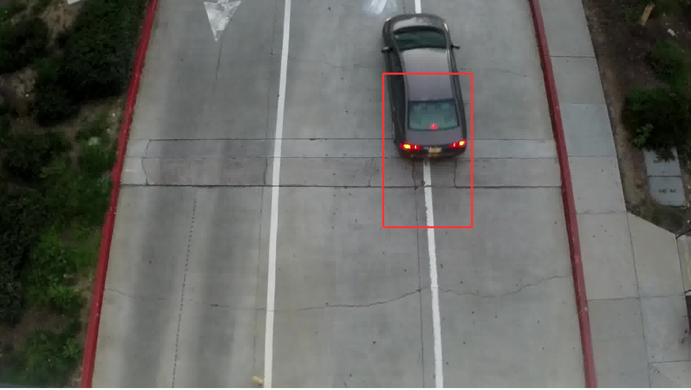
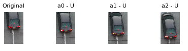

# bounding-box-prediction-RL

Bounding box prediction in object tracking using [Reinforcement Learning](http://www0.cs.ucl.ac.uk/staff/d.silver/web/Teaching.html). The model utilizes reinforcement learning to choose the best region for a given frame in the video. The model uses a Deep Q-network (DQN) to learn a state-action value function over numerous transitions with epsilon-greedy policy. From learning the optimal value function, we indirectly converge to an optimal policy. The optimal policy will allow the model to select the region that maximizes the value function for each given current state. 

  

  

The model is designed to learn from video frames and bounding box annotation from the top-down view video captured from an entrance of a parking structure. This model can be extended to other videos of similar application, but the input structure needs be prepared. 

The repository contains code to train and test reinforcement learning in Keras with TensorFlow backend. 

## Requirements

The code in the repository requires [Keras 2.0.5](https://keras.io/) with [Tensorflow 1.0](https://www.tensorflow.org/install/), using Python 2.7 along with the following python libaries:

* numpy
* pandas
* matplotlib
* cv2

The python modules can be installed using: 'pip install numpy pandas matplotlib opencv-python'.

## Getting Started

First you will need to copy the project and download the necessary weights in your local machine. 

### Prerequisites

1. Clone the repository: `git clone https://github.com/DonovanLo/bounding-box-prediction-RL.git`
2. Download the VGG16 weights: https://github.com/fchollet/deep-learning-models/releases/download/v0.1/vgg16_weights_tf_dim_ordering_tf_kernels.h5

The VGG16 weights will be placed in the same directory of the python scripts. The VGG model is used to create image descriptor for the DQN. 

## Running the tests

To run the test, perform the following. 

Run: `python testing.py -w=./model_qn_weights/model_epoch_19_e010_h5 -t=./test_images/ -gt=./test_images/PS12_1_7_gt.txt` or `python testing.py` to create the output visualization. 

The test file will loop over the number of cars found in the annotation. For each car in the loop, the script will feed the initial bounding box to the model. The model will iterate through a fixed number of steps/attempts and apply the optimal action to reach the target in the image. 

Each car will have a separate output. The output shows the number of actions and the result from taking the action at a particular state.

## Running the training

To run the training, perform the following. 

Run: `python training.py -t=../PS12_1_7_frames/ -gt=../PS12_1_7_gt.txt` to train the model. 

The training will need two items:
1. Extracted frames for the video
2. Ground-truth text file. The text file consists of bounding boxes around the targets using the [VATIC](http://carlvondrick.com/vatic/) tool.

With NVIDIA GTX 1080 Ti, it took 2 days to perform 19 epochs. 

## Authors

* **Donovan Lo** - [github](https://github.com/DonovanLo)

## Acknowledgments

* [Xiaobai Liu](https://cv.sdsu.edu/) , Computer Vision Professor at [San Diego State University](http://www.cs.sdsu.edu/)
* Thuan Chau - Peer
